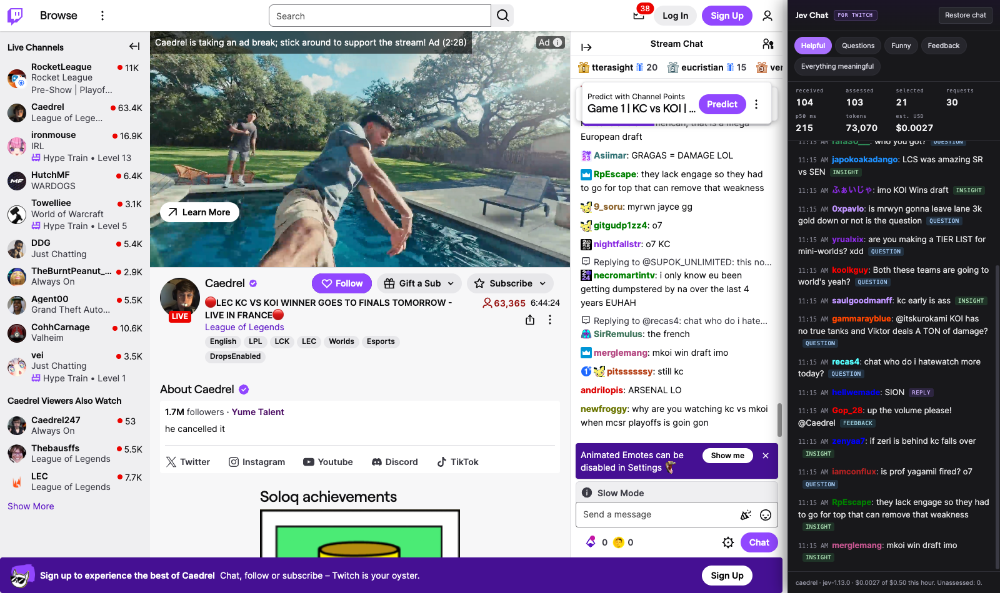

# Jev Chat for Twitch

A Chrome extension that adds a second chat column showing only the Twitch messages worth reading.



## Install in two minutes

You need Chrome and a TypeSafe key. No account with us, no build step.

1. **[Download the latest release zip](https://github.com/ethanplusai/jev-chat-for-twitch/releases/latest)**.
2. Unzip it. You get a folder called `extension`.
3. Open `chrome://extensions` in Chrome.
4. Turn on **Developer mode**. The switch is in the top right.
5. Click **Load unpacked**.
6. Choose the unzipped `extension` folder.
7. Open any live Twitch channel. Click the **gear** in the Jev Chat column on the right. (You can also use **Details**, then **Extension options**.)
8. Paste your TypeSafe key.
9. Click **Test key**. It should report a model id and a round trip in milliseconds.
10. Go back to the Twitch tab and reload it. Pick an intent chip in the Jev Chat column.

Chrome may warn you about extensions installed in developer mode, and may show that warning again after a restart. That is expected. It is what Chrome says about any extension not installed from the Web Store.

## Get a TypeSafe key

Sign up at [typesafe.ai](https://typesafe.ai) and create an API key. The key stays in your browser profile. You pay TypeSafe directly for what you use.

## What it does

- It reads the channel's live chat and asks Jev to judge each message.
- You pick an intent: Helpful, Questions, Funny, Feedback, or Everything meaningful. The column shows only the messages that fit.
- Every row is a real chat message. Nothing is rewritten and nothing is generated.
- Click a row to see the full probability distribution, the category and the model id.
- **Narrow chat** in the column header shrinks Twitch's own chat so both columns fit.
- Switching intent re-sorts what you already have. It costs nothing extra.

## What leaves your machine

The **message text and usernames of the channel you are watching** are sent to `https://api.typesafe.ai/v1/systemone` under your own TypeSafe account, along with the channel name, the page title and the last 12 message texts as context. Video is never sent.

Your API key is stored in `chrome.storage.local` in this browser profile, read only by the extension's service worker, sent only in the `Authorization` header to `api.typesafe.ai`, and never logged. Host permissions are limited to `www.twitch.tv`, `irc-ws.chat.twitch.tv` and `api.typesafe.ai`. The default content security policy applies and no remote code is loaded.

## What it costs

Measured on a live channel on 2026-09-19 with `jev-1.13.0`: a 20-message batch used **10,075 input tokens**, about **504 input tokens per message**, at $0.042 per million input tokens.

| Incoming chat rate | Messages assessed per hour | Estimated cost per hour |
| --- | --- | --- |
| 2 messages per second | 7,200 | about **$0.15** |
| 50 messages per second, default 10/s assessment cap | 36,000 | about **$0.76**, stopped by the default $0.50 cap after roughly 40 minutes |
| 50 messages per second, cap raised to 50/s | 180,000 | about **$3.81** |

These are estimates from recorded token usage, not a bill. The default cap is **$0.50 per hour**. When the cap is reached the column says so and stops calling Jev. Nothing silently degrades to a local heuristic.

## Limits

- Chrome only for now. There is no Firefox build.
- The install is developer mode until this is on the Chrome Web Store.
- Twitch can change its IRC endpoint, terms or rate limits at any time. The anonymous read-only connection used here is the one Twitch's own web chat uses, but it is not a contract.
- One channel at a time. The column follows the tab you are on.
- Emotes are shown as their text. No Twitch artwork is used or shipped.
- A relevance decision does not establish that a message is factually true.
- This project is independent of Twitch and of TypeSafe.

## Development

Zero dependencies and no build step. Node 22 or newer.

```
npm test        # offline tests, no network
npm run pack    # writes dist/jev-chat-for-twitch-<version>.zip
```

`docs/how-it-works.md` has the technical notes: the pipeline, the file map, the settings and spend state, and the measured numbers.

To cut a release, bump `version` in `extension/manifest.json`, then tag and push:

```
git tag v0.1.0
git push origin v0.1.0
```

The release workflow runs the tests, packs the zip, and publishes a GitHub Release with the zip attached.

## License

MIT. Copyright 2026 Ethan Rogers.
